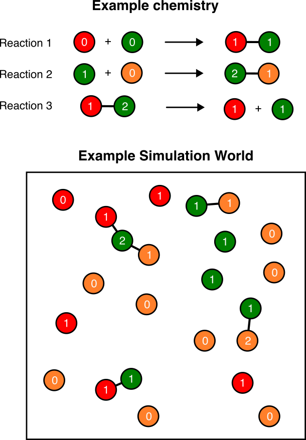
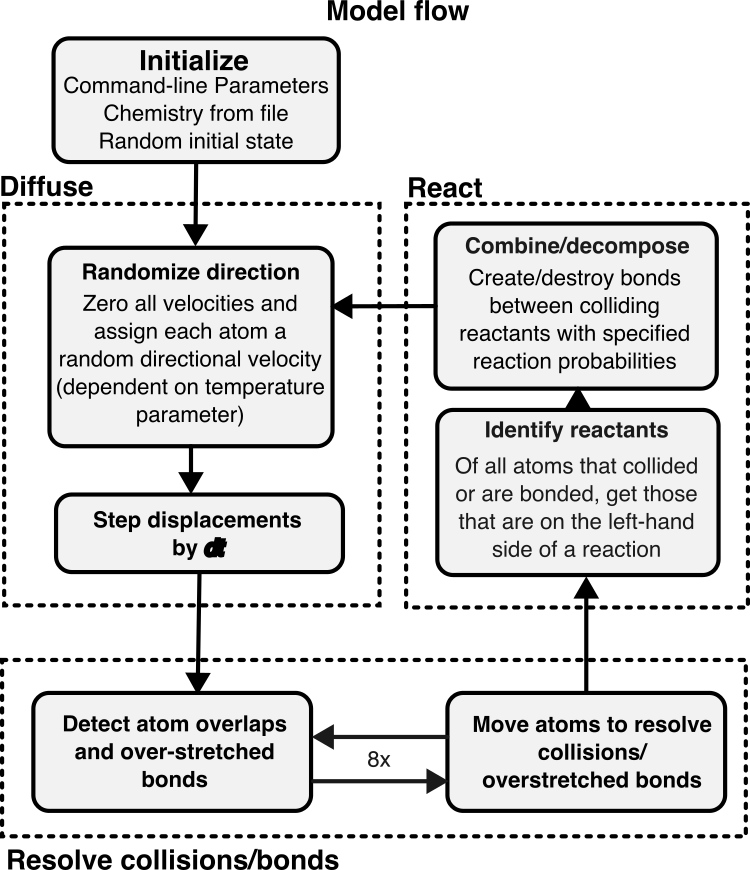

# Exploring the origin of evolvable life through generalized chemistries

*Submitted by Bhaskar Kumawat for the CMPLXSYS 530 final project*

## Introduction

Various theories based on physical and chemical principles have tried to explain the origin of life from abiotic matter [@Sutherland2017-ql]. The RNA world hypothesis and Manfred Eigen's hypercycles are two distinct examples of such an effort [@Higgs2015-pm; @Eigen1978-px]. Artificial chemistry is a related sub-field of complex systems that tries to arrive at a minimal system that can explain the origin of self-replication, regardless of the substrate [@Banzhaf2015-qk]. Previous work has shown the emergence of autcatalytic networks and replicators in such artificial chemistries [@Hutton2002-gz]. However, no artificial chemistry systems as of now have shown a mode of self-replication where "mutations" in chemical structure are faithfully carried forward into future replicators. This phenomena, called *Replication involving replicable imperfections* or RIRI forms the basic motivation for this project [@Benner2014-cq]. In essence, I wanted to create a software framework where observing such a transition, from non-replication to replication to RIRI would be possible. The core principles that I used to create this framework as follows:

1. Performance: The software must be performative enough to be able to simulate a number of particles on the order of $10^5-10^6$ on a powerful computer/cluster. This requirement made me switch from python to the Rust language for the program. As of now, I can simulate around $10^4$ particles without throttling and even $10^5$ particles with some throttling on a desktop computer.
1. Customized chemistries: A user must be able to specify arbitrary combination/decomposition rules for "atoms". This is done using a `chemistry.cfg` file provided as an input to the program.
2. Artificial Physics: The simulation must be stochastic and must follow some thermodynamic criteria making it more akin to real world physics. In this case, I decided to use "temperature-dependent" brownian motion to model the random motion of atoms.

The first release of the software is now available at the following link: [https://github.com/kumawatb/lifefromscratch/releases/tag/v1.0.0](https://github.com/kumawatb/lifefromscratch/releases/tag/v1.0.0) . The source code can be found at the associated github repository: [https://github.com/kumawatb/lifefromscratch](https://github.com/kumawatb/lifefromscratch).


## Methods

### Model Description

The model consists of a 2D plane with circular rigid-body atoms that move around and collide with each other. Each atom has a "species" and a "state" (both numbers between 0 and 255). while the species remains constant through the simulation, the state can change during reactions. Reactions are essentially interaction rules that are triggered if two atoms in the world are bonded or whenever two unbonded atoms collide. These reactions can be of three types:

1. Combination: A reaction where two colliding atoms form a bond and may or may not change the state of both atoms.
2. Excitation: A reaction where two colliding atoms change state without bonding together.
3. Decomposition: A reaction where two bonded atoms split, destroying the bond and possibly changing state.

A "chemistry" is a set of such reactions that are followed in a particular simulation. @fig-schematic shows an example chemistry with three reactions and the simulation world that arises as a result.

{#fig-schematic width=50% fig-align="center"}

Chemistries are specified using a `chemistry.cfg` file containing a single line for each possible reaction in the world. The contents of an example `chemistry.cfg` file with one reaction of each type are shown below. 

```
# Number outside the curly braces denote species
# Number inside curly braces denote states
# equal symbol (=) denotes a bond
# plus symbol (+) denotes a reaction on collision (or a split)
# Ordering is important! Excitations/state changes occur in order
00{00} + 00{00} -> 00{01} = 00{01} # Combination reaction
00{01} = 00{01} -> 00{01} + 00{01} # Decomposition reaction
00{00} + 00{01} -> 00{01} + 00{01} # Excitation reaction
```

- Reactions of the type `a + b -> a=b` indicate bond formation. 
- Reactions of type `a=b -> a + b` indicate bond decomposition, and 
- `a + b -> a' + b'` is a simple excitation where the states of the atoms change without any affect on bonds.

### Model schedule

{#fig-schedule width=60% fig-align="center"}

A schematic of the model schedule is shown in @fig-schedule. The entire setup can be essentially divided into four parts.

- **Initialization**: Here, the program initializes the parameters and chemistries required for the simulation. It also generates a random initial state for the system based on a random number seed and the initial number of atoms (provided as parameters).

The following steps are repeated until the user ends the simulation:

- **Diffusion**: Each atom is assigned a random velocity in any direction (with magnitude proportional the the temperature parameter). In this step, the simulation takes note of all collisions (overlapping atoms) and bond extensions and tries to resolve them by moving the atoms by a computed distance. This step is performed 8x times because sometimes resolving collision between two atoms may create other collisions in the world.

- **Reaction**: Here, all atom pairs that collided with each other are checked for a “reaction” by looking their species/states up in the user specified chemistry. If two colliding atoms can react, they are either bonded and/or their state is changed based on the reaction type. Bonded atoms are also checked for decomposition.

### Model output
Before creating output files, the program performs the following computations on the world state.

- It creates a "network" of atoms, with edges denoting bonded atoms.
- It splits the network into individual components and classifies the different components into "molecule" groups using a graph-isomorphism algorithm based on the atomic states. Essentially, two molecules are considered the same if they are topologically similar and all the corresponding atoms have the same state.

Then, it outputs all unique molecular structures that are observed into a `./output/structures` directory as graphviz network (.dot) files. It also outputs the counts of all molecules that exist in the world every few seconds (given as an input argument to the program using `--output-every <t>`) into a `molecule_counts.csv` file in the `./output` directory.

### Model Analyses
As of now, I've only tested two different chemistries, one at two different temperature values, and one with two different number of atoms.

- **Simple**: The first one is a simple chemistry where all atoms are of the same species (species 0) and combine together on collision to form a molecule. The expectation is that after a long time, all the atoms in the world would be part of a single giant molecule. The corresponding `chemistry.cfg` specification is

    ```
    00{00} + 00{00} -> 00{00} = 00{00}
    ```

I simulated this chemistry with 1000 atoms for temperature values 200 and 500.

- **Complex**: The second chemistry has two different species of atoms and includes reactions of all three types. The chemistry specification is

    ```
    00{00} + 00{00} -> 00{01} = 00{01} # Species 0 self
    00{00} + 00{01} -> 00{01} = 00{02}
    00{01} + 00{01} -> 00{02} = 00{02}

    01{00} + 01{00} -> 01{01} = 01{01} # Species 1 self
    01{00} + 01{01} -> 01{01} = 01{02}
    01{01} + 01{01} -> 01{02} = 01{02}

    01{02} + 00{01} -> 01{03} = 00{02}
    01{03} = 01{02} -> 01{02} + 01{01}
    ```

I simulated this chemistry at a temperature of 200 with 5000 and 10000 atoms.

## Results

### Simple chemistry

First, to verify that the simulation works, I used a simple chemistry where I expected a specific outcome. In this case, I decided to model a chemistry where only a single species of atom is present and the atoms are "sticky", i.e., they freely bond with other atoms in the world. The results of this simulation are shown in @fig-ressimple. As expected, the number of complex molecules, those containing multiple atoms bonded together, increases over time. The overall molecule counts for each type, however, decreases rapidly. This is because each of the structures is created through *idiosyncratic* collisions and these structures do not self-replicate. As such, the number of types of molecules increases but the population of each molecule goes down.

{#fig-ressimple width=70%}

### Complex chemistry

Next, I modelled a chemistry with two different atomic species that can bond with themselves or with an atom of the opposite type, but in a complex manner. In this case, the state of an atom is essentially a counter for the number of atoms bonded to it, and if the counter reaches 2 the atom stops forming new bonds with other atoms of the same type. I expected that this would give me long "polymer" like molecules that have different number of the different species atoms in their sequence (somewhat like a DNA molecule). This chemistry also includes a "decomposition" reaction ensuring that we don't get really large molecules. The results for this chemistry are shown in @fig-rescomplex. In this case, I saw the formation of large polymeric molecules (sometimes circular) that included atoms of both species, and in different numbers. This is promising as I can use this chemistry as a starting point for future experiments. 

{#fig-rescomplex width=70%}

## Discussion

I was able to write an agent-based simulation model where the agents are different atomic species with different states and can bond and split from each other to create large molecules. I also tested this simulation with two different chemistries and saw some interesting molecule structures, especially the formation of long atomic chains. However, the analysis is still lacking when it comes to my origin goal of observing replication involving replicable imperfections (RIRI). Noteably, neither of these chemistries show faithful self-replication---while the number of large molecules grows with time, these molecules are not part of a cycle that produces more copies of the same molecule. The complexity thus increases solely due to a "crystallization-like" reaction rather than direct transfer of information between a parent and a child molecule. To observe self-replication, an autocatalytic reaction set is required which I plan to write next, specifically using Tim Hutton's squirm3 model [@Hutton2002-gz]. This requires a larger number of reactions (around 200) but it has been previously verified to give rise to membrane-bound replicating cell-like molecules. 

The results from this project present a good first test of the framework. They also provide us a null expectation for what to expect from simple non-replicating chemistries. In particular, we see that the number of large complex molecules rarely goes up over time. Instead, small molecules are more likely to be enriched in the system and create an evolutionary dead-end from which it is difficult to recover. If a replicator were to arise in such a chemistry, we would see rapidly growing curves in the graphs in panels (c) and (d) for [@fig-ressimple; @fig-rescomplex] and not a stable or monotonically decreasing population. 

## References

::: {#refs}
:::